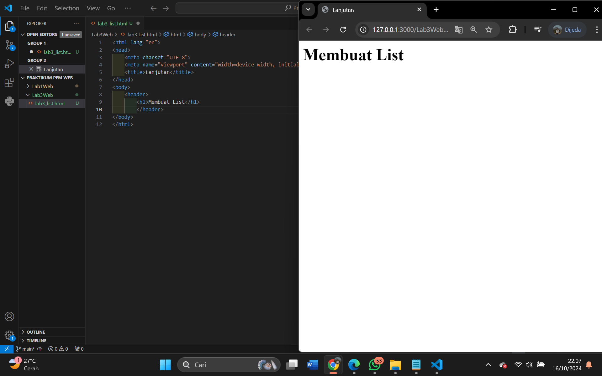
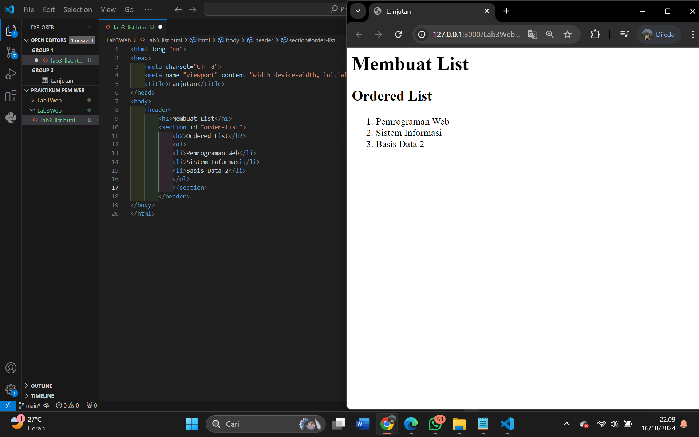
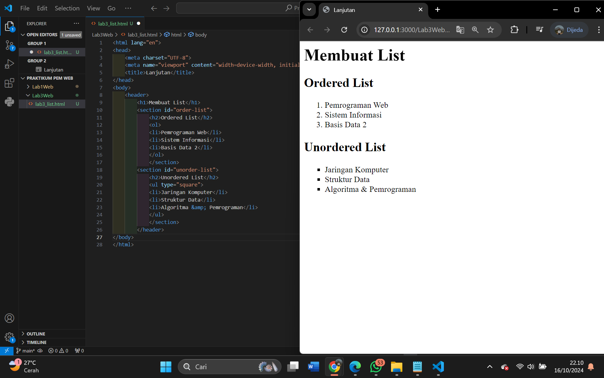
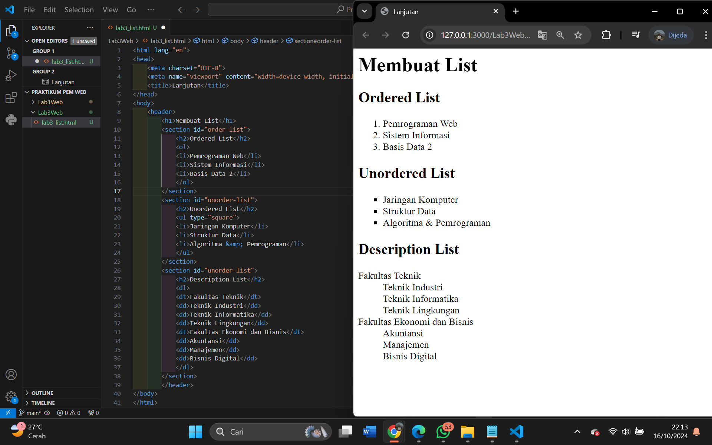
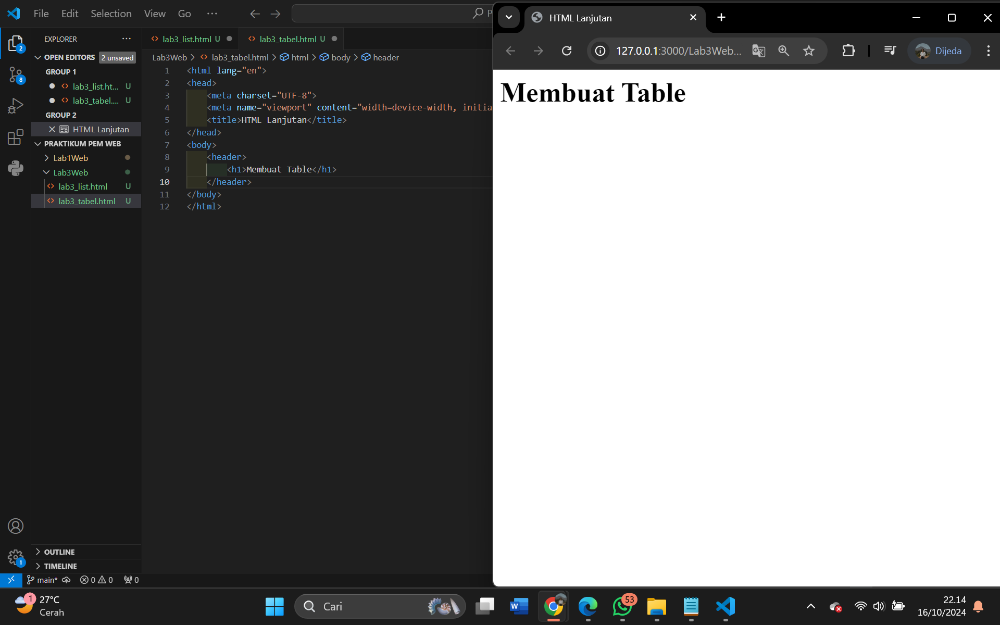
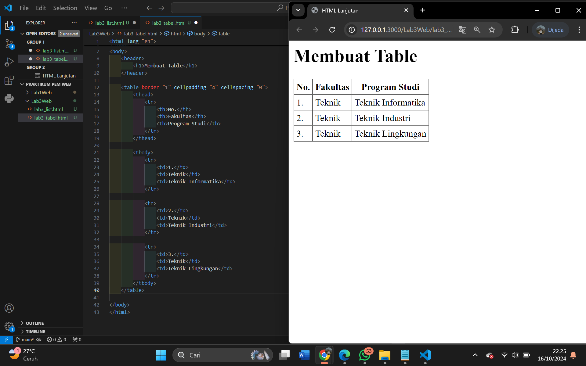
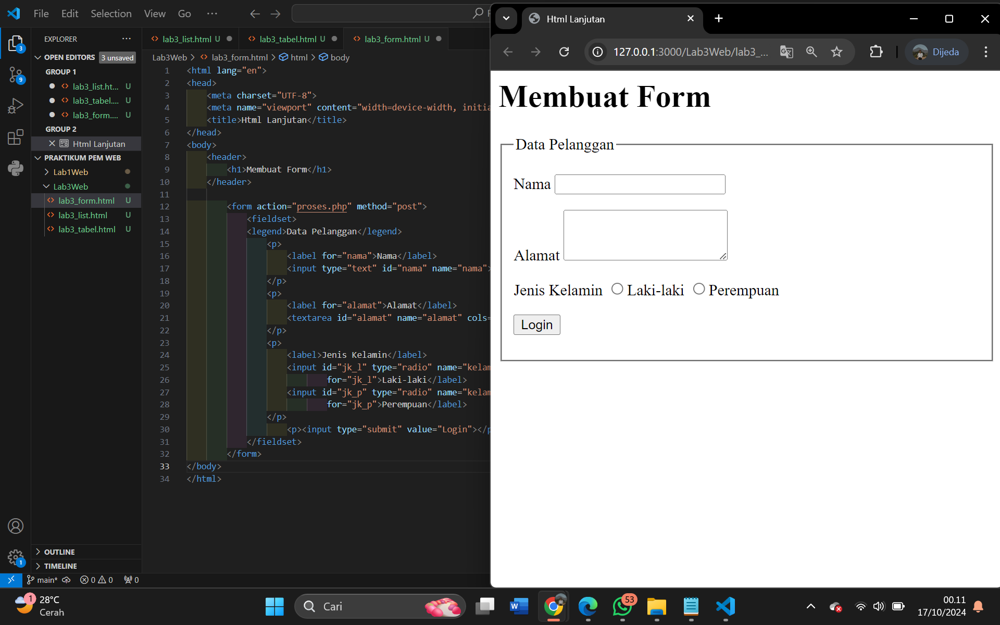
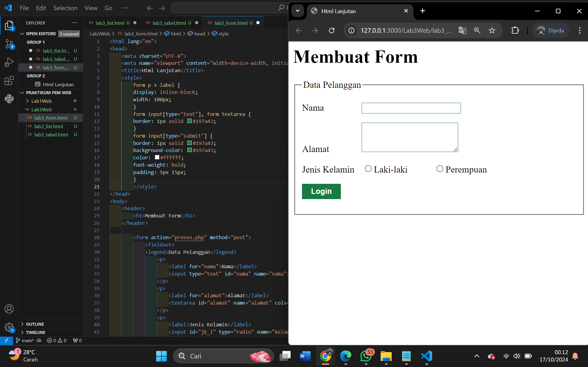
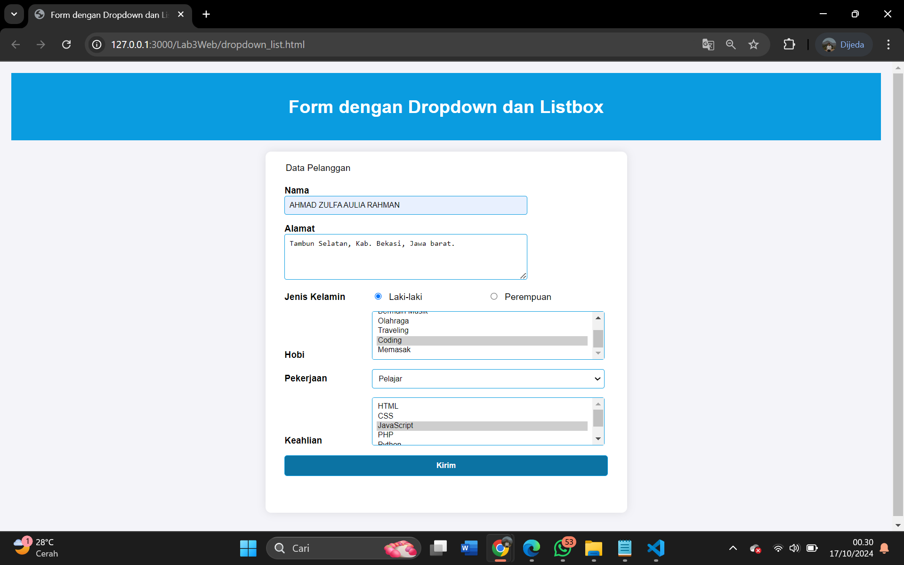

# Tugas Praktikum Pemrograman Web

#### 1. Membuat file baru dengan nama lab3_list.html.html 

# 

#### 2. Membuat Ordered List

# 

#### 3. Membuat Unorderd List

# 

#### 4. Membuat Description List

# 

#### 5. Membuat Tabel Buat file baru dengan nama lab3_tabel.html

# 

#### 6. Menggabungkan Sel Data

#  

#### 7. Membuat Form Buat file baru dengan nama lab3_form.html

# 

#### 8. Menabahkan Style pada Form

# 

### Pertanyaan dan Tugas
1. Buatlah form yang menampilkan dropdown menu dan listbox dengan multiple selection.

### Jawab

File `dropdown_list.html` berisi Form yang menampilkan dropdown menu dan listbox dengan multiple selection. 
Hasil Screenshot dari File Tersebut.

# 
